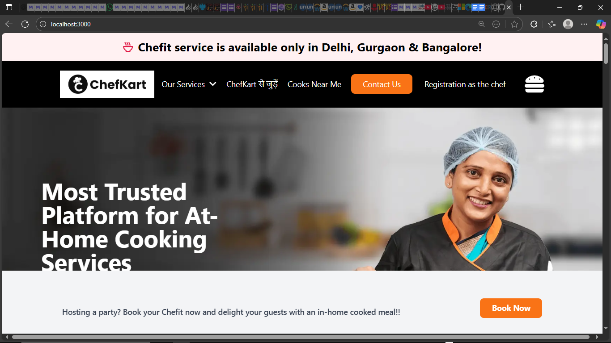
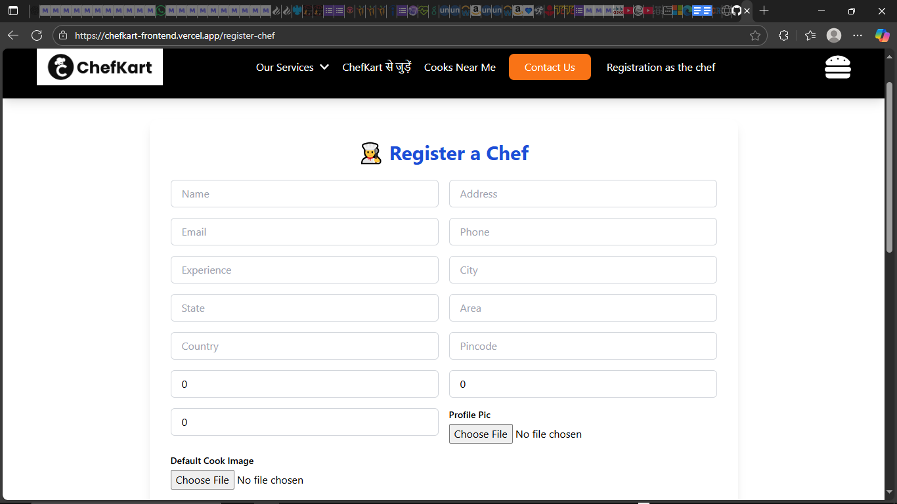
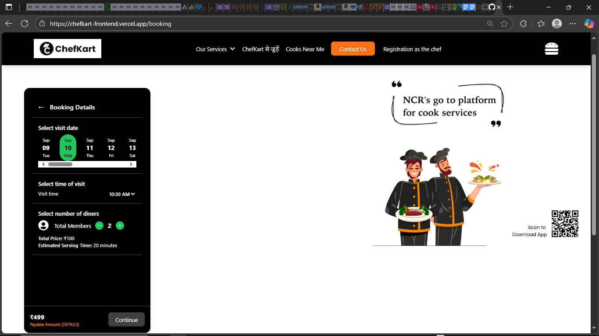
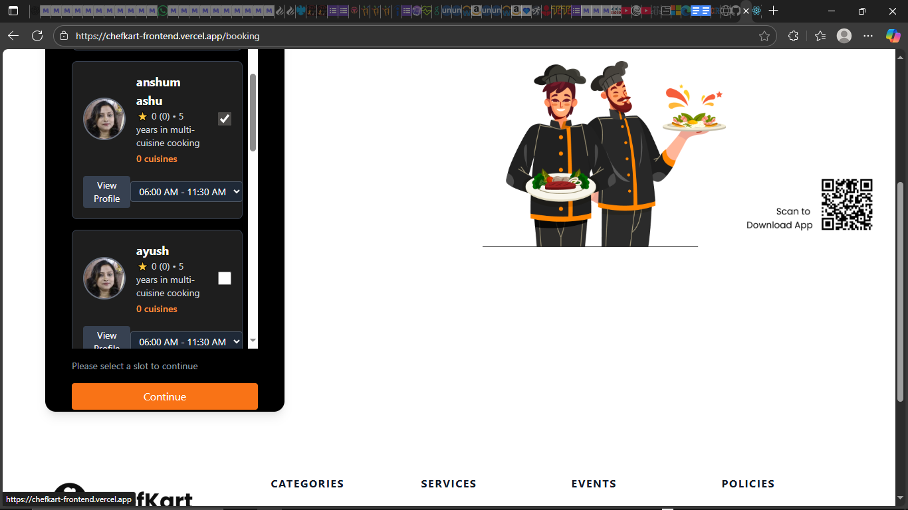
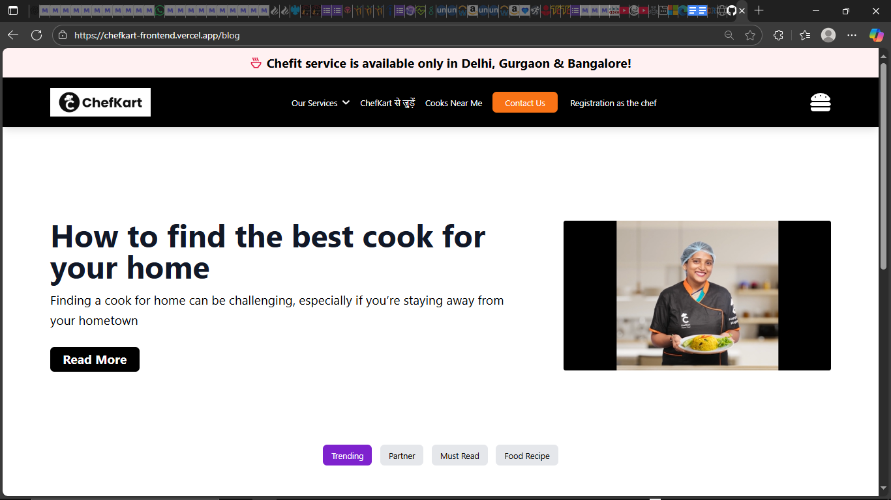
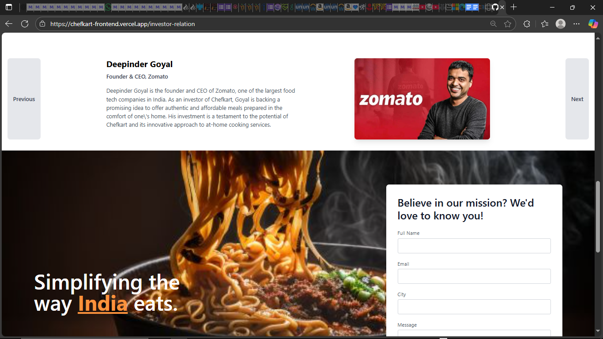
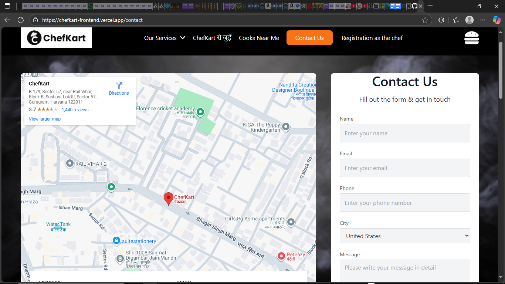

# 🍳 ChefKart Web Application

## 📌 Overview

ChefKart is a **full-stack web platform** that allows users to book professional chefs for events or monthly services. It provides detailed chef profiles, availability, ratings, and an intuitive booking system. The application includes an **admin dashboard** to manage users, chefs, and bookings efficiently.



---

## 🚀 Features

* 👨‍🍳 **Book Professional Chefs** for one-time events or recurring services.
* 📝 **Chef Profiles** with detailed info, ratings, and availability.
* 📆 **Real-Time Booking Updates** to manage schedules easily.
* 📊 **Admin Dashboard** for chefs, users, and bookings management.
* 💳 **Razorpay Integration** for seamless payments.
* 🌐 **Responsive UI** built with **Tailwind CSS**.
* 🔗 **RESTful APIs** tested with **Postman**.
* ⚡ **Scalable Backend** hosted on **Render** and **Frontend** on **Netlify**.

---

## 🛠️ Tech Stack

| Frontend          | Backend    | Database | Tools & Deployment |
| ----------------- | ---------- | -------- | ------------------ |
| React.js          | Node.js    | MongoDB  | Render (Backend)   |
| HTML, CSS         | Express.js |          | Netlify (Frontend) |
| Tailwind CSS, MUI |            |          | Postman (API Test) |
| Razorpay          |            |          |                    |

<p align="center">
  
  
  
  
  
  
  
  
</p>

---
## 🔧 Installation & Setup

1. Clone the repository:

```bash
git clone https://github.com/AnshumAshu/chefkart.git
cd chefkart
```

2. Install dependencies for both frontend and backend:

```bash
cd client
npm install
cd ../server
npm install
```

3. Start the development servers:

```bash
# In one terminal
dcd server
npm start

# In another terminal
cd client
npm start
```

4. Access the app at `http://localhost:3000`.

---

## 📸 Screenshots

| Services                           | Chef Profile                              |
| ----------------------------------- | ----------------------------------------- |
|  |  |

| Booking Page                              | Booking Page                                  |
| ----------------------------------------- | --------------------------------------------- |
|  |  |

| Blog Page                           | Investors Profile                              |
| ----------------------------------- | ----------------------------------------- |
|  |  |

| Contact Page                              | Payment Dashboard                               |
| ----------------------------------------- | --------------------------------------------- |
|  |  |

---

## 🌐 Deployment

* **Frontend:** Hosted on [Netlify](https://www.netlify.com/)
* **Backend:** Hosted on [Render](https://render.com/)

---

## 📬 Contact

💡 Have questions or feedback? Reach out via email: **[anshumashu2002@gmail.com](mailto:anshumashu2002@gmail.com)**
